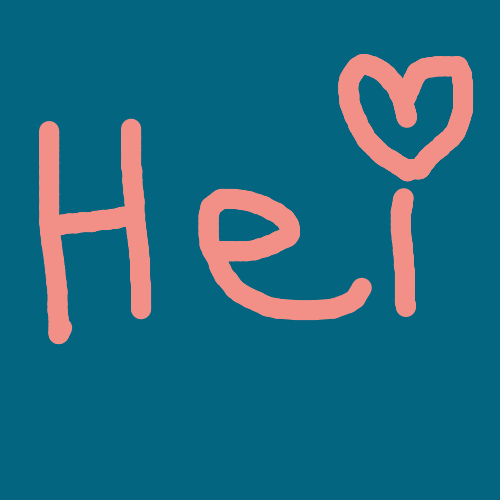

# A little drawing example program written in Rust with GTK+
Draw with left or right click, save your creation with ctrl-s.

I built this little program as an educational excercise to learn how to use `gtk-rs`.
It has been quite a ride. I can only suggest you to read the tutorial at https://gtk-rs.org/docs-src/tutorial/. In addition, this macro is very useful (and still missing in the tutorial): https://docs.rs/glib/0.10.3/glib/macro.clone.html.

I learned about quirky events and getting out of the way of the dreadful borrow-checker and that took me quite a while, but I like the result:

